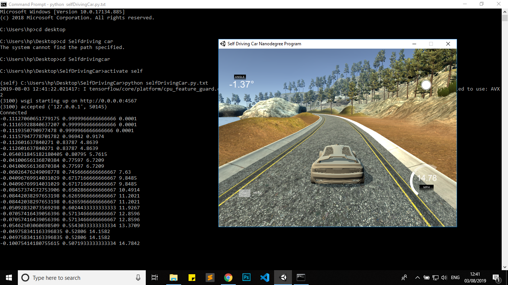
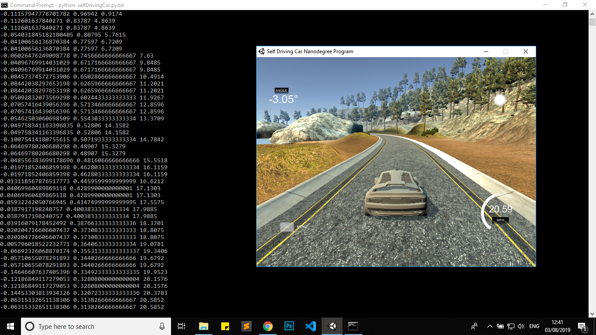
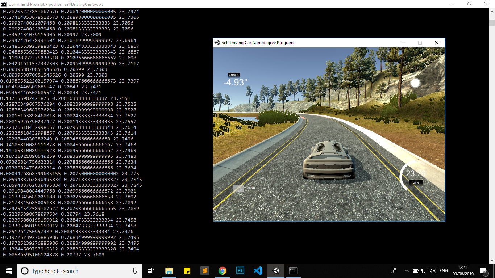

# Self_Driving_Car

This Project gives a glimpse of a real-world self-driving car.This is a model totally based on Nvidia Self Driving Car model.A Convolutional neural network(CNN) is trained to map raw pixels from a single front-facing camera directly to steering commands.

---
#### Coded in Google Colaboratory
#### Data is trained using Self Driving Car Simulator of Udacity
[SELF DRIVING CAR SIMULATOR-UDACITY](https://github.com/udacity/self-driving-car-sim)

### click [here](https://drive.google.com/drive/folders/1YaSpo5tzH0YO6AKuS2zXLbFn6CkjKuSU?usp=sharing) to view train data

---
### Libraries Used
* os
* matplotlib
* numpy
* keras
* scikit
* imgaug
* pandas
* opencv

---
Here are some screenshots of Running model :

---

---

---
